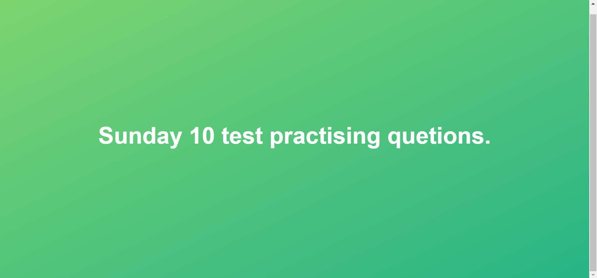

# Sunday 10 test practising quetions.

Adding photos.

---

`1.`Write a code to take time in seconds and convert it into hour, mins and seonds.

- Eg:

input:
5000

---

`2.`Write a code to take temperature in Fahrenheit and convert it to Celsius.

C=(F-32)\*5/9

---

`3.`Take a number and find the "ans" by sum of sqaure of digits. once you find this "ans" repeat the steps ( I mean find sum of square of digits of ans) and repeat this process until you get 1.

Eg: 49 => 44 + 99 =>16+81 => 97
since 97 is not equal to 1 so we will repeat the steps
97 => 99+77 = 81+49 = 130
it is still not 1: so lets repeat
130 => 11 + 33 + 0 => 10 it is still not 1: so lets repeat
10 => 1\*1 +0 = 1

If after certain number of steps finally we get 1 than number is called "CodeSpecial"

in case if it is not possible to get 1 after any number of steps than lets call that number "SomethingUnusual"

---

`4.`Abhishek choudhary is the teacher of a higher secondary school. He was assigned a task to record the number of students in each class. The 1st class has ‘A ’ students and 2nd class has ‘B’ students. He completed noting down all the classes but till he reached class xth the school was over. When he was going through the list he noticed that the next class had students equal to the sum of its last two classes. Can you help him to find out the number of students present in xth class using the above details.

---

`5.`No if else is allowed.

Take 3 numbers and find and return biggest of them. If all three numbers are same than print "None of them is biggest"

if there are two numbers same as biggest than also print "None of them is biggest"

---

`remaing we coming.....`
